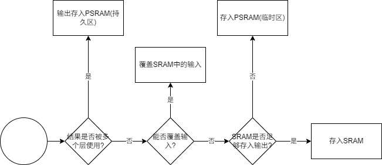
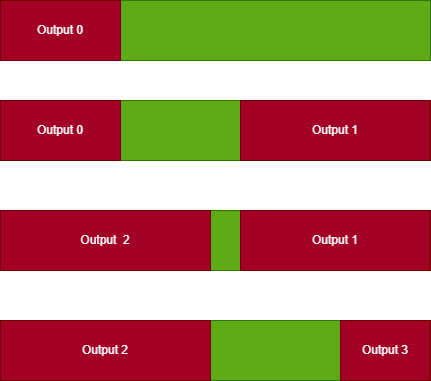

# 1. U31存在的问题
如果把U31当作一颗低成本**AI芯片**, 它最显著的2个问题是:
- 过于依赖SRAM, 而SRAM又太小, 导致内存严重不足. 
- NCHW(宽高优先)与NHWC(通道优先)互不兼容.  

此外, 还有一些设计赶不上变化的情况, 比如:
- 不支持8bit SIMD指令, 却强行用了8bit量化.
- 高位寄存器不太够
这里不做过多讨论.

## 1.1 SRAM太小(PSRAM利用率不足)
好几个应用都不能用PSRAM是一份方面;  
另一方面, **U31上缺乏高效利用PSRAM的机制**: 
- 多数情况下, PSRAM得先读入SRAM(需要占用SRAM), 再加载到寄存器才能参与运算. 无法直接从PSRAM到寄存器. wdma能做到部分PSRAM->寄存器, 但wdma支持的通道数太少了.  
- CNN计算一轮时, 往往得到少量输出数据, 但PSRAM需要大量连续读写. 这种少量数据累积多了再往PSRAM写时, 往往又意味着等待(读写无法同时进行)
实际工作中, 即使是从PSRAM读数据(通过wdma), 也能感受到读写的速度是远快于计算的速度的.  

通过v4(8bit)模型做个**大致估算**, 模型一帧的运算量大约是**76M**(MACs), 时钟开销约40M. 240M的U31跑满能到6帧(因为和cmos图像采集要串行所以只能到4.8帧), 大致推算出U31的运算能力为**469M**(MACs/s).  
PSRAM的读写速度为200M/s, v4(8bit)模型所有层输入+输出为7.3M. 200/7.3=**27.4帧**, 27.4\*76=**2082.4M**(MACs/s). 也就是说, 即使**全部输入输出都放到PSRAM的情况下, 芯片的运算速度要达到U31的4.4倍, PSRAM的读写速度才会成为瓶颈**.  
当然, 前提是PSRAM的读写要完全隐藏到计算后面, 目前U31很难搞(主要是写).  

## 1.2 NCHW(宽高优先)与NHWC(通道优先)互不兼容.

对于CNN模型,特别是小模型来说,绝大多数的层的逻辑是基于NCHW(宽高优先)的, 只有1\*1卷积是基于NHWC(通道优先)的.  
但是, 1\*1卷积的总计算量会占到整个模型的**85%~90%**!!  
剩下10%左右是3\*3(depthwise)卷积, 其他各层的运算量大概率低于5%.  

U31实现的情况是, 同时存在了这2种优先顺序. 这导致了以下的问题:
- 输出无法覆盖输入, 增大内存占用.
- 同样的计算过程, 有时需要2份代码来支持这2种输出顺序.
- 甚至有时候需要同时输出这2种顺序. 增大内存占用.
- 2种优先顺序, 意味着读写通常是不连续的!

总的来说, NCHW(宽高优先)的优缺点是:
- 优点: 通用性高, 除了1*1卷积和第0层(可能是3通道输入), 其余层都是宽高优先的逻辑
- 缺点: 对1*1卷积执行效率低.

NHWC(通道优先)的优缺点是:
- 优点: 对1*1卷积执行效率高.
- 缺点: 通用性低.

# 2. 下一颗CNN芯片的展望
我预想的下一颗芯片, 应该是:
- 外部逻辑, 用c实现, 开源编译器编译成RISC-V汇编代码
- CNN计算, 由`自动生成工具`读取`onnx`模型生成汇编代码

这里最核心的就是如何让`自动生成工具`能够自动生成全套高效CNN计算代码, 全程无需人工干预.  
还有个边界问题, 就是**CNN结果的解析**. 工具中可以内置几种解析层的实现, 其余的最好是放在外围用c实现.  

首先我们必须划分出芯片的边界:`它有哪些事能做, 哪些事不能做`? 对应到CNN上来, 需要确认的是:
- 要支持的模型有哪些?(为了体现通用性, 最好能支持一些公开的小模型.)
- 最大支持的分辨率/通道数/窗口尺寸是多少?
- 这些模型中有哪些奇奇怪怪的层?(包括5\*5,7\*7,以及更大尺寸卷积, 各种非depthwise卷积, 非常规尺寸的窗口如2\*2, 2\*3...)
- 这些模型中用到了哪些激活函数?
- 要支持的量化类型有哪些? (最好只支持1种)

这些问题如果设计前期不确定, 到后期就不一定好搞了.  

另外, `自动生成工具`的前提是必须要有PSRAM!!!只有SRAM的情况下太难倒腾了!!!

## 2.1. 向量寄存器
从实现CNN的角度上来说, U31的向量指令极其没用. 不是难用, 是没用!  
调用一次需要准备十几个参数, 这是只难用(编译器可以让它稍微好用一点).  
真正让它"没用"的, 是每个向量指令都必须包含`读`,`算`,`写`这3个步骤 --- 没有中间结果!  
比如 
$$V_a=V_b+V_c+V_d$$
需要拆分成2个步骤来计算: 
$$V_x=V_b+V_c$$
和
$$V_a=V_x+V_d$$
作为中间结果的$V_x$必须经历一次完整的读写过程. 这完全是多余的. 计算步骤再多一点, 那就是疯狂的读写内存了.  
而这个问题, 只需要加入一个`向量寄存器`的概念就能解决.  
并且作为开发者, 在CNN的实现过程中我是希望`向量指令`+`向量寄存器`能全面取代SIMD的:
- 向量没有固定长度:  
  在1*1卷积的实现过程中, 最难`自动化`的就是根据`输入通道数`与`输出通道数`,将寄存器分配给`输入`与`卷积核`.   
  即使寄存器资源充足, 也意味着每种不同的输入输出通道数都需要一份汇编代码来支持.  
  如果用长度可以参数化的`向量寄存器`, 这个问题就完美解决了.
- 不用多种长度的寄存器和指令混用  
  U31实现CNN时, 面对12/18这种通道数时(不能被8整除, 需要拆分成12=8+4, 18=2*8+2),往往需要多种寄存器/指令混用.  
  编程难度提升的同时, 寄存器和指令资源也都增加了.
- 不用考虑乘法升位带来的开销倍增  
  对于SIMD乘法, 当最长的寄存器是128位时, 只能算64位*64位=>128位, 浪费了64位的算力.  
  同时, 前面步骤的读和算都只能按照64位进行, 否则就需要引入转换的开销.

## 2.2. 读写机制
CNN计算过程中, 每一个轮次的计算, 都需要读/写一段数据到寄存器(通常读>>写).  
这种读写模式往往相当固定且连续(连续的前提是存储顺序统一).  
设输入通道数为N, 对于1\*1卷积:
- 读:
  - 输入*N
  - 卷积核*N
- 写:
  - 1个输出  

对于3\*3depthwise卷积(卷积核固定是3\*3\*N, 可以在计算前就读入寄存器):
- 读:
  - 输入第一行*N
  - 输入第二行*N
  - 输入第三行*N
- 写:
  - 输出*N

可以看到, 这种方式对窗口的大小非常敏感.  
理想的调用方式是: 
- 每层计算前, 组装好读写的格式, 分配好接收读取数据的寄存器
- 触发第一个读, 进入循环
  - 等待上一个读
  - 触发下一个读
  - 计算
  - 写数据(不等待)
- 循环结束, 等待所有写数据完成

这种触发/等待的机制, 不管是按窗口读还是连续读, 都是必要的(让连续读也不占用CPU指令).  
为了更好的屏蔽读的开销, 这里使用了双缓冲的机制, 意味着需要**更多的寄存器**接收读取的数据.  
这里最麻烦的是`写`. 因为读写的目标可能都是PSRAM(甚至是PSRAM+SRAM). 且每次写的量都很小. 因此需要底层设计适配的机制, 让PSRAM小数据量的读写能尽可能的同步, 不阻塞.  

## 2.3. 统一NCHW(宽高优先)与NHWC(通道优先)
对于我们这种极致压缩成本,又需要有不错性能的芯片来说, 并没有什么选择, NHWC(通道优先)应该是唯一的选择.  
而这引发的问题就是, 我们在设计初期就需要确切的知道会有哪些类型的层要处理. 因为这些层绝大多数是基于宽高优先结构.  
同时, 由于读写的双缓冲机制, 我们需要足够的`向量寄存器`来存放2倍窗口大小的数据, 再加上卷积核和一些中间结果, 寄存器数量的需求肯定不低. 所以必须提前规划可能的窗口尺寸.

## 2.4. 内存自动分配机制
当满足了:
- 顺序统一
- 向量指令+寄存器好用
- PSRAM读写顺畅  

这些条件之后, 内存的分配就完全可以自动化运行了:

SRAM中存储的输入/输出数据, 如果不覆盖, 总是Ping-Pong来回使用. 下图中, 绿色表示空闲部分, 红色表示已分配部分.  

而PSRAM足够大, 完全足以划分出2片空闲区域. 其中:
- 持久区: 整个模型计算过程中都不清理(持久区占用大小可以根据模型确定)  

- 临时区: 循环使用, 不会产生碎片.  
  

# 3. im2col + GEMM
别想了. 抛开矩阵乘法模块没开源不说, im2col操作需要极高的内存带宽和内存容量, ddr玩家专属, PSRAM玩不转的.

# 4. winograd
有点鸡肋的优化. 对于小模型来说, 85%~90%的运算量集中在1\*1卷积, winograd是无能为力的.  
对于5\*5卷积, winograd的加速效果从理论上来说都很一般了.  
只有3\*3卷积是winograd的领域. 但是它又只能用于stride=1的3\*3卷积.  
即使经过winograd能快1倍, 对整体百分比提升也在个位数以内. 后面可以有精力再考虑吧.
